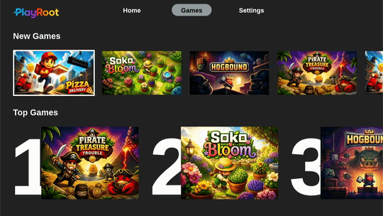

# PlayRoot

> An open-source game console. 

## What is it?
PlayRoot is an open game console built for a new generation of play. We believe great games can be accessible to everyone—free, without ads, in-game purchases, or barriers between players and the experiences they love. PlayRoot brings players and creators together in one open, community-driven platform. A place to discover new worlds, share ideas, and turn great concepts into unforgettable games.

The project is designed to be truly plug and play. Booting directly into a full-screen console UI. No internet required.

## Current State

- A custom Yocto layer for the device image
- A Rust supervisor and Slint UI launcher
- Controller setup and mapping flows
- It includes a few game examples
- Network and Bluetooth management in the launcher
- Raspberry Pi support (only tested Raspberry Pi 4)
- Generic HID (USB) controllers such as 'NES' and 'SNES'
- Playstation 5 Dualsense controller support

## Quick start 

- Download a prebuilt image, or build one yourself, and install it with Raspberry Pi Imager.
- For first boot and device setup, see [docs/getting-started.md](docs/getting-started.md).
- For image and UI build instructions, see [docs/building.md](docs/building.md).

## Repository layout

- `meta-piconsole/` contains the Yocto layer and image recipes.
- `slintui/openconsole/` contains the Rust supervisor, Slint launcher UI, assets, and game manifest.
- `docs/` contains setup and build documentation.

## License

PlayRoot is released under the GNU General Public License v3.0.

In short, you can use, study, modify, and redistribute the project, but distributed modified versions must remain under the same license and include the corresponding source code. See [LICENSE](LICENSE) for the project license summary.

## Contributing

Contributions are welcome.

If you are a developer, designer, game creator, or tester who wants to help shape an open console built around joyful, accessible play, you are invited to contribute. Improve the experience. Bring new games and ideas to life. PlayRoot is meant to grow through people who care about great games, open systems, and making great games more accessible.

## Contact
For questions, collaboration, or contribution inquiries: hello@playroot.org